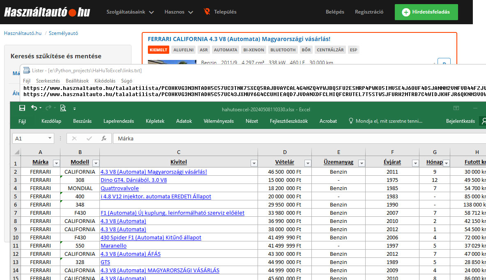

# HaHuToExcel

## Leírás:
Az alkalmazás a hasznaltauto.hu keresési találatait egy Excel (.xlsx) fájlba menti.
Az Excel fájlban szűréseket, statisztikákat tudunk egyszerűbben és gyorsabban elvégezni különböző paraméterek alapján.

## Telepítés:
Az alkalmazás futtatásához a [Python](https://www.python.org/downloads/) keretrendszer telepítése szükséges.

**Függőségek telepítése:**

`pip install -r requirements.txt`

## Használat:
A hasznaltauto.hu-n megadott keresési találatok linkjét kell bemásolni a `links.txt` fájlba. 
A fájlban több keresési találat is megadható, minden linket csak egy új sorban kell megadni, így több tipust is össze tudunk hasonlítani. 
A program futattása után a táblázatba mentett adatok (ha az Excel telepítve van) automatikusan megnyílik. 

**Program indítása:**

_(a program könyvtárából futattva)_

`python hahutoexcel.py`
## Authors:
montpiere.gh@gmail.com